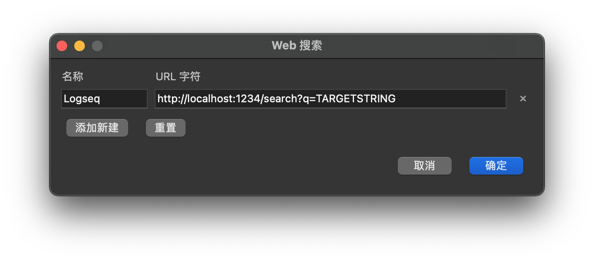
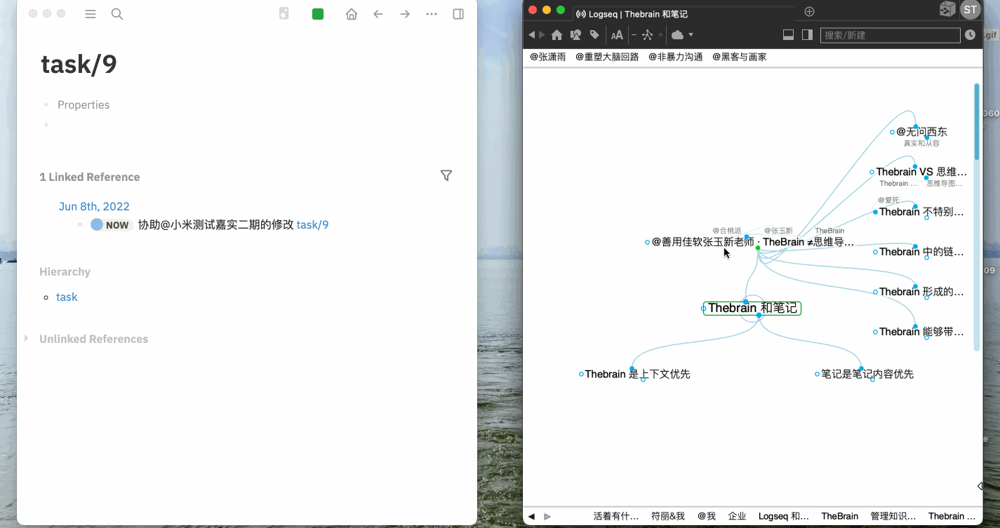

# thebrain-jump

[](https://pdm.fming.dev)


从 thebrain 跳转到 Logseq 页面的一个 HTTP 服务，使用 docker 打包

想法来自 https://www.bilibili.com/video/BV1rY4y1x7dT

## 使用方法

```bash
$ git clone git@github.com:largomst/thebrain-jump.git
$ cd thebrain-jump
$ docker compose up -d
```

在 thebrain 菜单栏中选中 `选项` - `开始网络搜索` - `编辑` - `添加新建`：



加入一条新记录 `http://localhost:1234/search?q=TARGETSTRING`，然后就可以使用 thebrain 的搜索功能跳转到 logseq 中的指定页面了。




